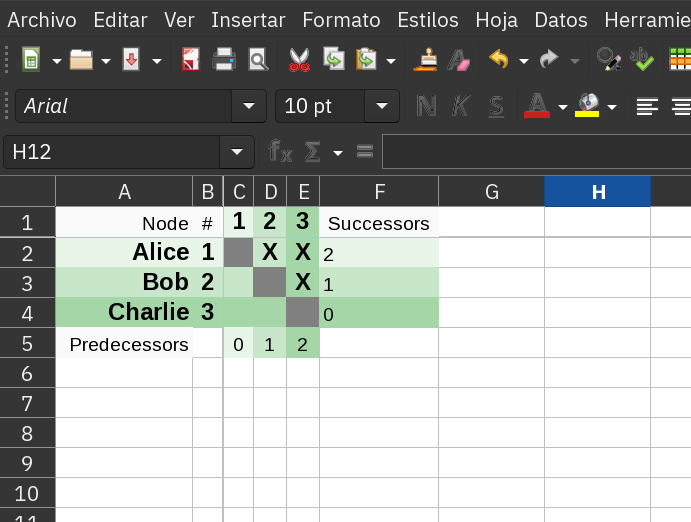

= DSM Tool

A simple command-line tool that creates an Excel file with a link:https://en.wikipedia.org/wiki/Design_structure_matrix[Dependence Structure Matrix] from a text file.

== Input format

The input text file has a dependency on each line. The source node of the graph is separated from the
target node of the graph using a colon ':'.

For example, the file:

[source, txt]
----
Alice : Bob
Alice : Charlie
Bob : Charlie
----

Defines an input graph with three nodes (`Alice`, `Bob` and `Charlie`) and three edges or "dependencies":

- `Alice : Bob` means that `Bob` depends on `Alice`.
- `Alice : Charlie` means that `Charlie` depends on `Alice`.
- `Bob : Charlie` means that there is an edge from `Bob` to `Charlie`, this is, that `Charlie` depends on `Bob`.

== Output format

The output is generated as an Excel file with name `output.xlsx` (existing ones will be overwriten).

The excel file will have the same number of rows and columns, elements in the matrix represent 
the dependencies. See link:https://en.wikipedia.org/wiki/Design_structure_matrix[Dependence Structure Matrix] for details.

With the example file above, the result would be:

== Compiling

- Install Java 8 or above.
- Install maven.
- Clone the repository.
- Build with `mvn install`

== Running

[source, bash]
----
java -jar target/dsm-tool-0.0.1-SNAPSHOT-jar-with-dependencies.jar [input-file]
----

Then open the generated Excel file "output.xlsx".

== License

This software is (C) 2022 Antonio Vieiro, distributed under the Apache License. See link:LICENSE.txt[LICENSE.txt].

